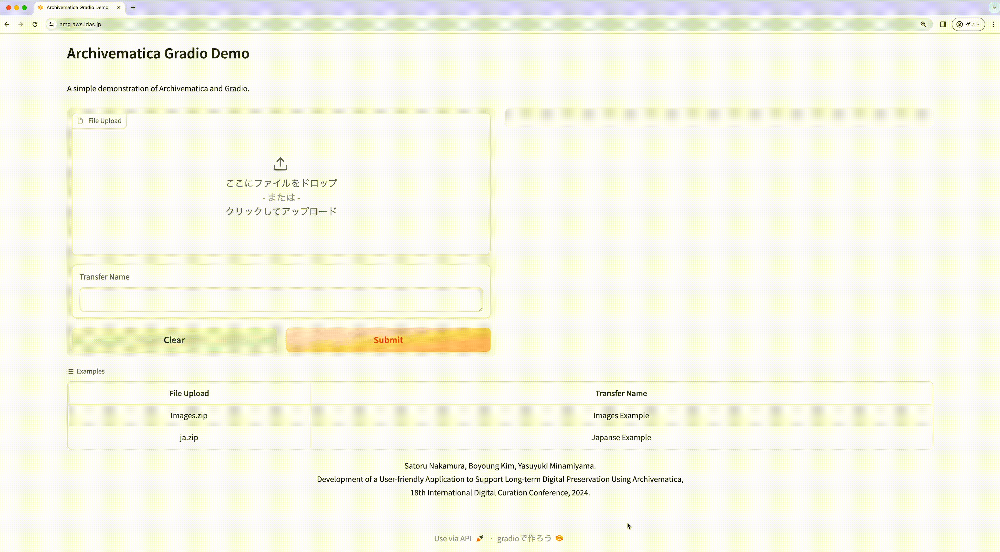

# Archivematica Gradio

A demonstration of Archivematica and Gradio.



## 🌐 Website

[Visit the demo page](https://amg.aws.ldas.jp/) to try it out.

## 📖 Preparation

Update `src/.env` with the following information.

```
DASHBOARD_URL=http://localhost:62080
DASHBOARD_USERNAME=test
DASHBOARD_API_KEY=test

STORAGE_SERVICE_URL=http://localhost:62081
STORAGE_SERVICE_USERNAME=test
STORAGE_SERVICE_PASSWORD=test

AWS_ACCESS_KEY_ID=xxxxxxxxxxxxxxxxxxxx
AWS_SECRET_ACCESS_KEY=xxxxxxxxxxxxxxxxxxxx
AWS_BUCKET_NAME=xxxxxxxxxxxxxxxxxxxx

LOCATION_UUID=xxxxxxxx-xxxx-xxxx-xxxx-xxxxxxxxxxxx
PROCESSING_CONFIG=automated
TRANSFER_TYPE=standard
TRANSFER_SOURCE_PREFIX=transfer_source
```

## 📖 Development

```bash
python -m venv .venv
source .venv/bin/activate
pip install -r src/requirements.txt

docker compose up --build
```

## 📖 Production

Update `docker-compose-prod.yml` with the following information.

```yml
version: "3.0"

services:
  gradio:
    container_name: "archivematica_gradio"
    build: .
    volumes:
      - ./src:/workspace
    ports:
      - "7865:7860"
    environment:
      VIRTUAL_HOST: xxx
      LETSENCRYPT_HOST: xxx
      LETSENCRYPT_EMAIL: xxx

networks:
  default:
    external:
      name: xxx
```

```bash
python -m venv .venv
source .venv/bin/activate
pip install -r src/requirements.txt

docker compose -f docker-compose-prod.yml up -d --build
```
